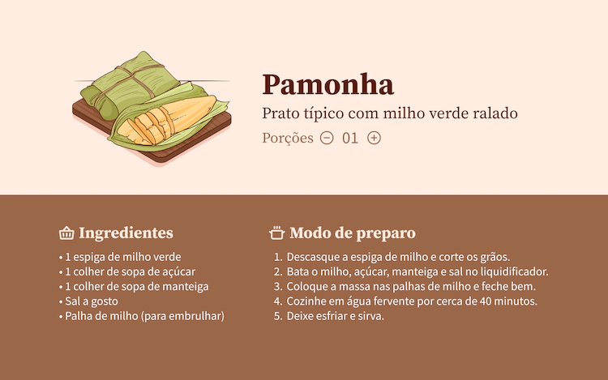

<h1 align="center"> 
Uma Receita Junina
</h1>

Desenvolvimento de uma versão web de uma experiência de receita junina.

  

 

  

 

## 🚀 Tecnologias

Esse projeto foi desenvolvido com as seguintes tecnologias:

- HTML
- CSS
- Figma
- Javascript

 

## DEMO

https://github.com/Ciro-TI-System/A-June-Recipe/assets/78507494/1ef85943-4ad8-4104-8f27-90a1d8d1b53a

## 🔖 Layout

Você pode visualizar o layout do projeto através [DESSE LINK](https://www.figma.com/community/file/1255887923488942888). É necessário ter conta no [Figma](https://figma.com) para acessá-lo.

 

## 📝 License

Esse projeto está sob a licença MIT.

---

Feito por Ciro Batista da Silva
